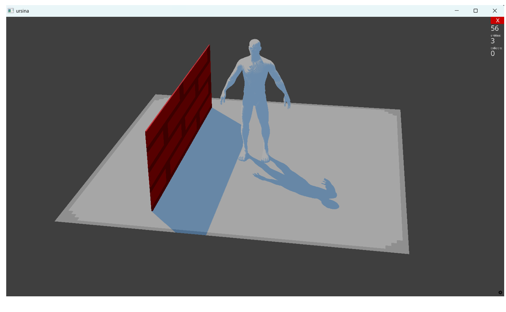

#  3D Application with Ursina Engine

## Overview
This project was developed by **João Pedro Dutra Araujo Ribeiro** using the **Python** programming language.  
It leverages the **Ursina Engine**, a high-level game engine for Python designed to simplify the creation of **interactive 3D applications**, such as games, simulations, and visualizations.

---

## About the Ursina Engine
The main advantage of Ursina is its **ease of use**, allowing developers to create fully functional 3D scenes with just a few lines of code.  
It also supports **external 3D modeling**, enabling the import of `.obj` models, textures, and other graphic assets.

In this project, a **free 3D human model** was used, along with **basic geometric shapes** (such as cubes and planes) and **textures** provided by the Ursina library itself.

---

## Features
- Real-time **camera control** through the `EditorCamera()` class, allowing movement and rotation using the mouse and keyboard — ideal for testing and exploring the 3D scene.  
- **Modular structure**, enabling easy adjustments and additions to the environment.  
- **Lightweight and accessible**, perfect for beginners exploring 3D graphics programming in Python.

---

##  Application Preview

---